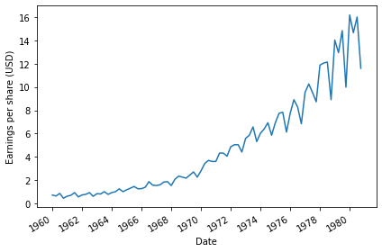
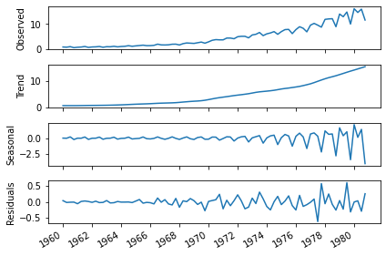
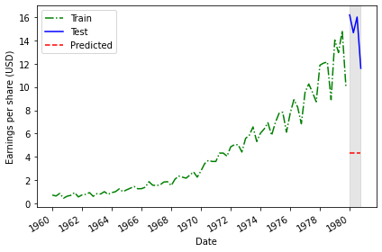
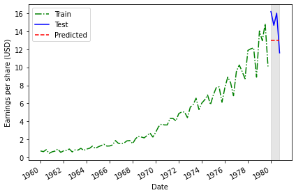
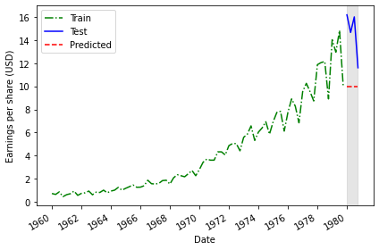
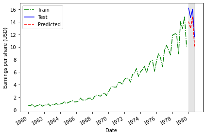

[<back to portfolio](https://mickael-wajnberg.github.io/)

 
Here you will find practical work on time series forcasting in the different notebooks

Notebook 1 : Introduction

- predict the quarter dividend (earning per share) from johnson and johnson
 
 
  
- establish seasonality

- models are historical mean, last year mean, last value, naive seasonal copy of last year

 
 
 
- evaluation is made by MAPE
 

Notebook 2 : 

- established the GOOGL stock market (google) is a random walk with Augmented Dickey-Fuller and Autocorrelation. so, it cannot be predicted by itself well
- prediction are simply drift, last value and mean

 

Notebook 3 : 

 
gfhjhf

Notebook 4 : 

[<back to portfolio](https://mickael-wajnberg.github.io/)
